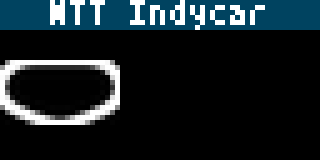

# Indycar Next Race and Standings

Indycar displays next race details and current standings details for NTT Indycar or Indy NXT Series

Track outlines are sourced from indycar.com's official circuit diagrams.

Displayed:

- Next Race
  - Series Title w/corresponding background
  - Race Name
  - Track Name
  - Date / Time (localized)
  - US TV channel showing the race
  - Image of the track

- Driver Standings
  - Series Title w/corresponding background
  - Top 12 drivers in 3 panels
  - includes position, name and points

## Configuration
- Select series to display (NTT Indycar series is default)
- Select Display Type (next race or standings)
- Select Text Color
- For Next Race select date/time format

## Thanks
- Thanks a lot to @AMillionAir as the original maker of the [Forumla 1 applet](../formula1/).
- Thanks to @samhi113 for the original hand-drawn track art (since replaced with official indycar.com circuit outlines).

## Screenshot

 
